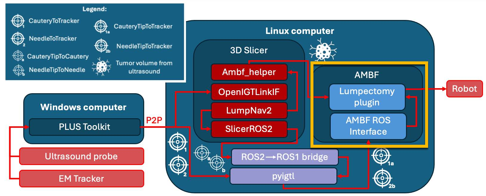
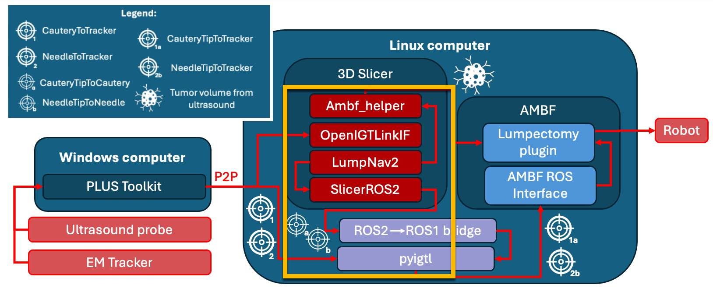

# Touching the tumor boundary: Ultrasound-based virtual fixtures for breast-conserving surgery

This repository contains all the necessary code and modules to run the virtual fixture code presented in the following
publication:

```
@article{connolly2025touching,
  title={Touching the Tumor Boundary: A Pilot Study on Ultrasound-Based Virtual Fixtures for Breast-Conserving Surgery},
  author={Connolly, Laura and Ungi, Tamas and Munawar, Adnan and Deguet, Anton and Yeung, Chris and Taylor, Russell H and Mousavi, Parvin and Fichtinger, Gabor and Hashtrudi-Zaad, Keyvan},
  journal={International Journal of Computer Assisted Radiology and Surgery},
  pages={1--9},
  year={2025},
  publisher={Springer}
}
```

The overall software diagram is available in Figure 1 of the paper. The following sections will explain how to run each
element of the system. This system was developed and tested on Ubuntu 20.04 using ROS2 galactic and ROS1 noetic.

## Part 1 - Collision detection and haptic feedback in AMBF



The AMBF plugin for this work was derived from the volumetric drilling simulator here: https://github.com/LCSR-SICKKIDS/volumetric_drilling
The code in this example was modified to support breast conserving surgery. The main modifications made were to 
volumetric_drilling.cpp, drill_manager.cpp, and the ADF file that loads the volume into the file. These changes were made to ensure
that the tool cursor is controlled by the ROS topic that corresponds to the EM sensor data. The file "launch_pyigtl_control_loop.py" file is 
the file that does this communication between pyigtl, ROS, and AMBF. This script is dependent on the ROS2 to ROS1 bridge (https://github.com/ros2/ros1_bridge/tree/galactic)

This code can be found in the "collision_detection" folder and was compiled against this version of AMBF (https://github.com/WPI-AIM/ambf/tree/f85f44b11061592ad0150efd760c69395a709a24)
The compilation instructions still match the original volumetric_drilling example.

## Part 2 - Setup from 3D Slicer



The helper module in Slicer is used to publish the Pivot calibrations automatically and to convert the tumor volume that is constructed from
ultrasound to png slices that can be loaded into AMBF. It is dependent on SlicerROS2 (https://github.com/rosmed/slicer_ros2_module), AMBF utils (https://github.com/LCSR-CIIS/ambf_util_slicer_plugin)
and OpenIGTLinkIF (https://github.com/openigtlink/SlicerOpenIGTLink).

## Part 3 - Visual navigation

Finally, for visual navigation, we rely on LumpNav2 which is available here: https://github.com/SlicerIGT/LumpNav/tree/master

## Workflow

1. Set up a peer to peer network between a Windows computer running PLUS toolkit and a Linux computer running this code. This can be done with an ethernet cable.
2. On the Windows computer, run PLUS with the config file from the LumpNav repo that connects to the Telemed utlrasound and Ascension 3DG tracker
3. On the Linux Computer, run ./launch_breast_virtual_fixture.sh - this bash file will launch all of the necessary components for this workflow. This includes: Slicer, the ROS2 to ROS1 brige, roscore, the AMBF_simulator using the bootstrapped study_guide script, and the control loop script that sends data from pyigtl and ROS to AMBF_msgs.
4. In Slicer, open the AMBF_utils module, the ROS2 module, LumpNav2, and the helper module.
5. Press "Activate OpenIGTLink" on the helper module interface - this should update the ultrasound image and position of the tools that are autopopulated in the scene from LumpNav2.
6. Run through the pivot calibration workflow in LumpNav2, annotate the tumor boundary from the 2D ultrasound images
7. Once you are satisfied with the Tumor Contour, press "Update AMBF volume" - this will convert the tumor into the necessary format for AMBF, calling on ambf_utils
8. Press "Update breast plugin file" to automatically configure up the "volumes.yaml" file.
9. Set up the LumpNav navigation views as desired. In the experiments in this paper, we used "Dual 3D view"
10. In the AMBF gui that pops up press the green button that says "Start Simulation"
11. In the terminal that is set up to launch the control loop run "python3 launch_pyigtl_control_loop.py". This script waits for the pivot calibrations. In Slicer press "Publish NeedleTipToNeedle" and "Publish CauteryTipToCautery".

If you are trying to run this example and need any assistance, please contact laura.connolly@queensu.ca
